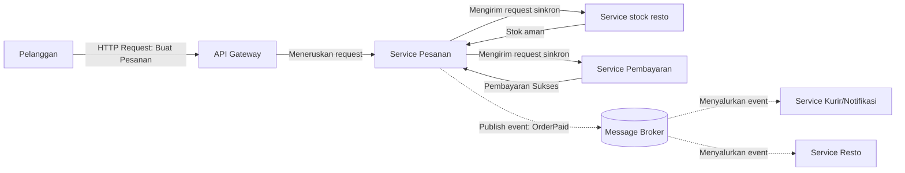
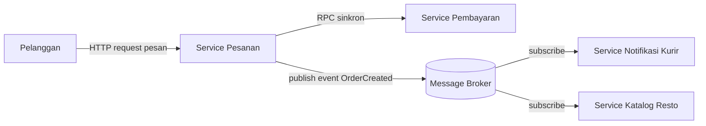

# Tugas 2 (Pekan 2) — Perancangan Arsitektur untuk FoodGo

**Materi terkait:** Architectural style (Layered, SOA, Peer-to-Peer, Publish-Subscribe).

## Studi Kasus

Melanjutkan Tugas 1: FoodGo butuh sistem yang **decoupled** agar tim kurir dan tim resto tidak saling mengganggu ketika salah satu modul diperbarui/deploy ulang. Saat ini semua modul (pesanan, pembayaran, notifikasi kurir, katalog resto) berjalan sebagai satu aplikasi monolitik — sekali deploy, semua modul ikut restart dan berisiko downtime total.

## Tugas Kelompok

1. Pilih **satu** gaya arsitektur utama: **Service-Oriented Architecture (SOA)** atau **Publish-Subscribe**. Boleh dikombinasikan (mis. SOA untuk service inti + Pub-Sub untuk notifikasi), tapi harus dijustifikasi kenapa kombinasi ini yang dipilih. [Alif]

Jawaban: Menurut analisis kelompok kami, kami lebih memilih menggunakan gaya arsitektur secara kombinasi, dengan mengombinasikan arsitektur SOA (Service-Oriented Architecture) dan Pub-Sub (Publish-Subscribe). 
- SOA digunakan untuk fondasi pemisahan modul dan independent deployment supaya server tidak berat dalam menjalankan FoodGo.
- Pub-Sub digunakan untuk event, notifikasi, dan komunikasi asynchronous. supaya kurir dapat menerima notifikasi secara asynchronous.

2. Gambarkan minimal 4 komponen berikut dan interaksinya: modul Pesanan, modul Pembayaran, modul Kurir/Notifikasi, modul Katalog Resto (dan message broker/API gateway jika relevan). [Bastian]



3. Jelaskan alur satu skenario penuh secara end-to-end di diagram (misalnya: pelanggan buat pesanan → bayar → resto terima notifikasi → kurir ditugaskan) — tunjukkan komponen mana berkomunikasi dengan siapa, dan **jenis komunikasinya** (sinkron/asinkron, request-response/event). [Didit]

Jawaban: 
- Inisiasi Pesanan oleh Pelanggan

  Komunikasi: Pelanggan --> API Gateway

  Jenis Komunikasi: Sinkron (Request-Response / HTTP Request)

  Penjelasan: Pelanggan menekan tombol buat pesanan di aplikasi. Aplikasi mengirimkan HTTP Request: Buat Pesanan ke API Gateway sebagai gerbang masuk utama sistem.

- Meneruskan Request ke Service Utama

  Komunikasi: API Gateway --> Service Pesanan

  Jenis Komunikasi: Sinkron (Request-Response)

  Penjelasan: API Gateway menerima request dari pelanggan, melakukan autentikasi/routing, dan langsung meneruskan request tersebut ke Service Pesanan.

- Pengecekan Stok Makanan

  Komunikasi: Service Pesanan $\rightleftarrows$ Service stock resto

  Jenis Komunikasi: Sinkron (Request-Response)

  Penjelasan:
  1. Service Pesanan mengirimkan permintaan sinkron (Mengirim request sinkron) ke Service stock resto untuk memverifikasi apakah menu yang dipesan masih tersedia.
  2. Service stock resto memeriksa database-nya dan mengembalikan balasan secara langsung (Stok aman)

- Eksekusi Pembayaran

  Komunikasi: Service Pesanan $\rightleftarrows$ Service Pembayaran

  Jenis Komunikasi: Sinkron (Request-Response)

  Penjelasan:
  1. Setelah stok dikonfirmasi aman, Service Pesanan mengirimkan permintaan sinkron (Mengirim request sinkron) ke Service Pembayaran untuk memproses transaksi keuangan.
  2. Service Pembayaran memproses transaksi dan memberikan respons balik secara langsung bahwa transaksi berhasil (Pembayaran Sukses).

- Penerbitan Event Pembayaran (Publish Event)

  Komunikasi: Service Pesanan --> Message Broker

  Jenis Komunikasi: Asinkron (Event-Driven / Publish)

  Penjelasan: Setelah transaksi dikonfirmasi sukses, Service Pesanan tidak memanggil modul lain secara langsung. Sebagai gantinya, Service Pesanan mempublikasikan sebuah pesan/event bernama [Publish event: OrderPaid] ke Message Broker. Setelah event terkirim, Service Pesanan dapat langsung menyelesaikan tugas utamanya tanpa perlu menunggu proses lain selesai.

- Penyebaran Event ke Service Terkait (Fan-out / Subscribe)

  Komunikasi: Message Broker --> Service Kurir/Notifikasi & Service Resto

  Jenis Komunikasi: Asinkron (Event-Driven / Subscribe)
  
  Penjelasan: Message Broker secara independen menyalurkan pesan OrderPaid tersebut ke dua service pendengar (subscriber):
  1. Service Kurir/Notifikasi: Menerima event (Menyalurkan event) untuk menjalankan pencarian kurir terdekat serta mengirimkan push notification status pengiriman ke pelanggan.
  2. Service Resto: Menerima event (Menyalurkan event) untuk memberi tahu aplikasi restoran agar pihak dapur segera menyiapkan makanan.

4. Analisis tertulis: kenapa gaya ini mengatasi masalah *coupling* dari Tugas 1, dan apa trade-off-nya (mis. Pub-Sub menambah kompleksitas debugging karena alur tidak linear). [Chaesar]
Jawaban:

- Alasan Kombinasi SOA dan Pub-Sub Mengatasi Masalah Coupling:

  Pemisahan Service dan Independent Deployment (Peran SOA):
  Pada sistem monolitik sebelumnya, semua modul menyatu dalam satu server sehingga jika ada update, seluruh aplikasi harus restart. Dengan SOA, modul dipecah menjadi layanan terpisah (Service Pesanan, Service stock resto, Service Pembayaran, Service Kurir/Notifikasi, dan Service Resto). Saat tim kurir atau tim resto melakukan deploy ulang pada modul mereka, modul transaksi utama seperti Service Pesanan dan Service Pembayaran tidak akan ikut ter-restart dan tetap bisa melayani pelanggan.

  Komunikasi Asinkron yang Tidak Saling Mengunci (Peran Pub-Sub):
  Setelah pembayaran berhasil, Service Pesanan tidak memanggil Service Kurir/Notifikasi atau Service Resto secara langsung, melainkan hanya menitipkan event OrderPaid ke Message Broker. Jika saat itu Service Kurir/Notifikasi sedang mati sementara karena baru di-deploy ulang oleh tim kurir, proses pemesanan di sisi pelanggan tidak akan ikut error. Pesan OrderPaid akan disimpan sementara di dalam antrean Message Broker dan langsung diteruskan begitu Service Kurir/Notifikasi aktif kembali.

- Trade-off (Konsekuensi Teknis) yang Muncul:

  Kompleksitas Debugging karena Alur Tidak Linear (Efek Pub-Sub):
  Karena pengiriman event OrderPaid dari Message Broker ke Service Kurir/Notifikasi dan Service Resto berjalan secara asinkron, alur program menjadi lebih sulit dilacak. Jika terjadi bug—misalnya saldo pelanggan sudah terpotong di Service Pembayaran tetapi notifikasi pesanan tidak masuk ke aplikasi kurir—tim developer akan lebih sulit mencari letak kesalahannya dibandingkan pada aplikasi monolitik yang alurnya lurus di satu tempat.

  Eventual Consistency:
  Karena menggunakan perantara Message Broker, status pesanan yang sudah dibayar tidak langsung muncul detik itu juga di aplikasi resto maupun kurir. Akan ada sedikit jeda waktu sampai event OrderPaid selesai disalurkan dan diproses oleh masing-masing service penerima.

  Network Latency pada Fase Sinkron (Efek SOA):
  Pada fase pembuatan pesanan, Service Pesanan harus menghubungi Service stock resto dan Service Pembayaran melalui jaringan (request sinkron). Proses komunikasi antar-jaringan ini tentu membutuhkan waktu respon yang sedikit lebih lambat dibandingkan pemanggilan fungsi di dalam satu aplikasi monolitik yang sama.

  Ketergantungan Baru pada API Gateway dan Message Broker:
  Walaupun antar-modul sudah tidak saling mengunci, kini API Gateway dan Message Broker menjadi komponen yang sangat kritis. Jika Message Broker mengalami gangguan atau down, maka seluruh pengiriman notifikasi ke kurir dan restoran akan terhenti.

## Cara Membuat Diagram (Gratis, Cukup Laptop)

Tidak perlu software berbayar. Dua opsi:

**Opsi A — Mermaid di dalam Markdown (disarankan).** Ditulis sebagai teks biasa di `README.md`, otomatis dirender jadi diagram oleh GitHub — tidak perlu install apa pun.

````markdown

````

**Opsi B — draw.io / diagrams.net** (gratis, jalan di browser tanpa akun, atau app desktop offline di [app.diagrams.net](https://app.diagrams.net/)). Ekspor sebagai `.png` dan simpan di folder `diagram/`.

## Struktur Submission

```
tugas-02-perancangan-arsitektur/
├── README.md          # Analisis + diagram Mermaid (jika Opsi A) atau referensi ke diagram/
├── JURNAL.md
└── diagram/            # File .png/.drawio jika pakai Opsi B
```

## Rubrik Penilaian (Tugas 2)

| Komponen | Bobot | Kriteria |
|---|---|---|
| Ketepatan pemilihan gaya arsitektur | 20% | Justifikasi SOA/Pub-Sub sesuai kebutuhan *decoupling* di skenario |
| Kelengkapan & kejelasan diagram | 30% | Semua komponen kunci ada, jenis komunikasi (sinkron/asinkron) jelas ditandai |
| Analisis trade-off | 30% | Bukan hanya kelebihan — kekurangan/kompleksitas baru juga dibahas |
| Proses & kontribusi kelompok | 20% | `JURNAL.md`, commit history |

## Batasan Penggunaan AI (Level 2)

Kebijakan **Level 2 (AI Assisted Idea Generation & Structuring)** berlaku — lihat [`../RUBRIK-UMUM.md`](../RUBRIK-UMUM.md). Boleh memakai AI untuk brainstorming komponen apa saja yang umum ada di gaya arsitektur SOA/Pub-Sub; **tidak boleh** meminta AI menggambar diagram final atau menuliskan analisis trade-off yang tinggal ditempel. Catat pemakaian AI di "Log Penggunaan AI" pada `JURNAL.md`.

- Diagram Mermaid/draw.io yang "terlalu generik" (identik dengan contoh tutorial di internet tanpa penyesuaian ke kasus FoodGo) akan dinilai rendah pada komponen kelengkapan & kejelasan diagram.

