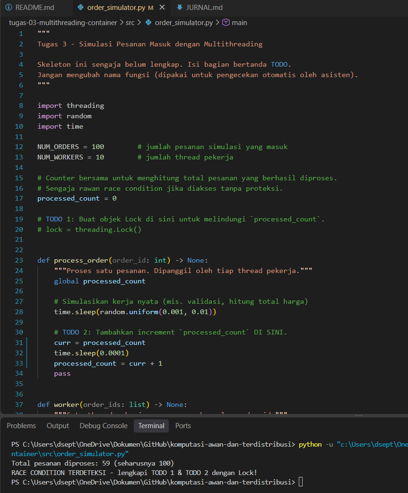
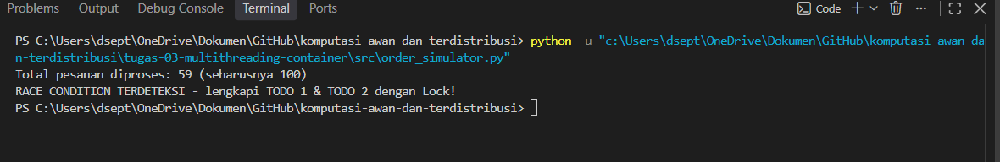
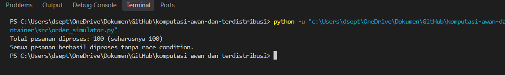
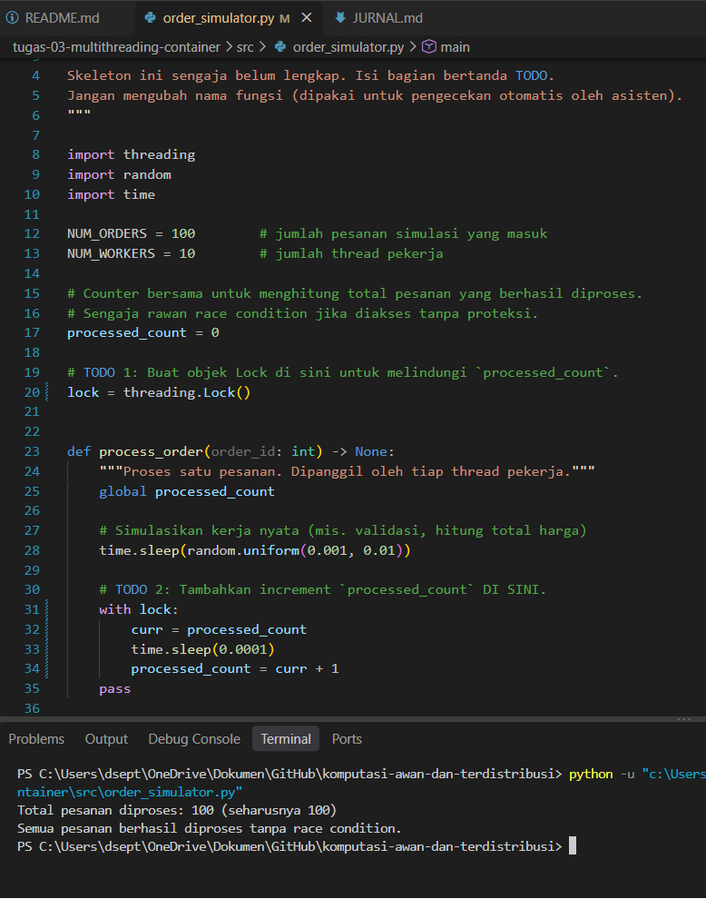
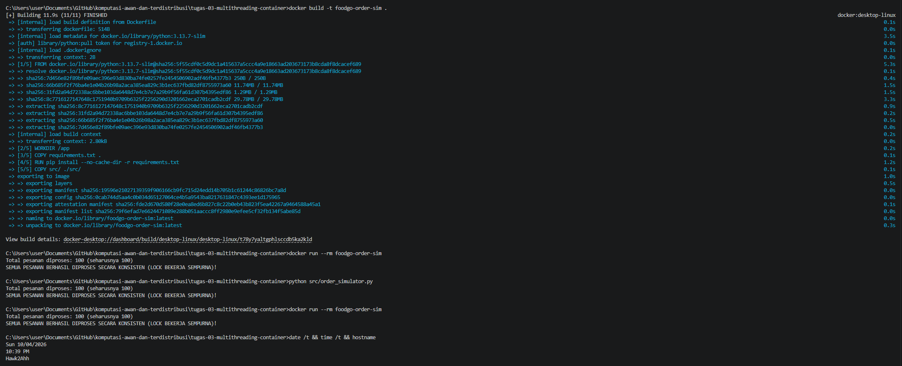

# Jurnal Proses - Tugas 3

# Jurnal Proses — Tugas 3

## Percobaan tanpa Lock

- Hasil `processed_count` yang didapat: **59** (seharusnya 100). Ada 41 pesanan yang tidak terhitung.

Kode yang dijalankan saat itu (baris lock masih di-comment):

```python
curr = processed_count
time.sleep(0.0001)
processed_count = curr + 1
```

Output:

```
Total pesanan diproses: 59 (seharusnya 100)
RACE CONDITION TERDETEKSI - lengkapi TODO 1 & TODO 2 dengan Lock!
```




- Kenapa bisa meleset:

  Menambah counter itu sebenarnya bukan satu langkah, tapi tiga: baca nilai lama, tambah 1, lalu simpan lagi. Karena ada 10 thread yang jalan bersamaan, dua thread bisa membaca nilai yang sama sebelum salah satunya sempat menyimpan.

  Contohnya: Thread A baca `processed_count = 10`. Sebelum A menyimpan, Thread B juga baca dan dapat 10. A menyimpan 11, lalu B juga menyimpan 11. Padahal ada dua pesanan yang diproses, tapi counter cuma naik satu. Kejadian seperti ini berulang terus sampai hasil akhirnya cuma 59.

  Catatan: kami sengaja memisahkan baca dan simpan, lalu menyelipkan `time.sleep(0.0001)` di antaranya. Kalau cuma ditulis `processed_count += 1`, dengan 100 pesanan race condition-nya jarang muncul sehingga susah dibuktikan. Jeda ini memperlebar celahnya supaya masalahnya kelihatan jelas.

## Percobaan dengan Lock

- Hasil `processed_count` setelah perbaikan: **100** (sesuai jumlah pesanan).

Perubahan kodenya:

```python
lock = threading.Lock()

with lock:
    curr = processed_count
    time.sleep(0.0001)
    processed_count = curr + 1
```

Output:

```
Total pesanan diproses: 100 (seharusnya 100)
```




Dengan `with lock`, hanya satu thread yang boleh masuk ke bagian baca, tambah, simpan dalam satu waktu. Thread lain menunggu sampai lock dilepas, jadi tidak ada lagi yang memakai nilai lama. Jeda `time.sleep(0.0001)` tetap kami biarkan di dalam lock untuk menunjukkan bahwa hasilnya tetap benar walaupun jedanya masih ada.

## Perbandingan

| Percobaan | Hasil | Seharusnya | Keterangan |
|---|---|---|---|
| Tanpa lock | 59 | 100 | Salah, 41 pesanan tidak terhitung |
| Dengan lock (lokal) | 100 | 100 | Benar |
| Dengan lock (Docker) | 100 | 100 | Benar, sama seperti lokal |

## Menjalankan di Docker

- `docker build -t foodgo-order-sim .` berhasil, selesai dalam 11,9 detik dengan base image `python:3.13.7-slim`.
- `docker run --rm foodgo-order-sim` dijalankan dua kali dan `python src/order_simulator.py` sekali di lokal. Ketiganya menghasilkan 100.



## Kendala Docker

- Error yang ditemui: Docker Desktop tidak mau jalan dan muncul pesan **"Virtualization support not detected"**.
- Cara memperbaikinya: menjalankan `wsl --install` di Windows PowerShell, lalu restart laptop. Setelah itu Docker Desktop bisa dibuka dan build berjalan normal.

## Pembagian Tugas

| Anggota | Bagian |
|---|---|
| Alif | TODO 3 (membagi pesanan ke thread dan menjalankan thread) |
| Didit | TODO 1 dan TODO 2 (lock dan increment counter) |
| Bastoam | Dockerfile dan pengujian container |
| Chaesar | README.md dan JURNAL.md |

## Log Penggunaan AI (Level 2)

> Wajib diisi sesuai kebijakan Level 2 di [`../RUBRIK-UMUM.md`](../RUBRIK-UMUM.md). Tulis "Tidak memakai AI" pada baris pertama jika memang tidak dipakai. Hanya untuk brainstorming ide/outline - bukan untuk kode/analisis/teks akhir.

| Tanggal | Tool AI | Prompt yang diberikan | Ringkasan saran/ide AI | Bagaimana diolah jadi tulisan/kode sendiri |
|---|---|---|---|---|
| 04/10/2026 | Gemini | "Jelaskan konsep race condition pada operasi counter multithreading di Python dan pembagian tugas kelompok 4 orang" | AI menjelaskan konsep non-atomic read-modify-write, cara kerja mutex lock di Python, dan menyarankan struktur pembagian kerja kelompok. | Kelompok kami membagi tugas berdasarkan 4 peran (Alif mengerjakan batching worker, Didit menangani lock, Bastian mengurus Docker, Chaesar menyusun jurnal dan analisis). Kode ditulis dan diuji coba sendiri di laptop. |
