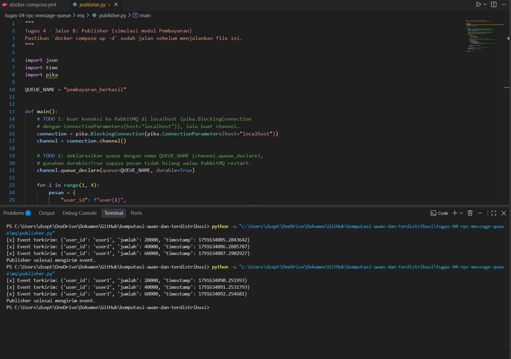
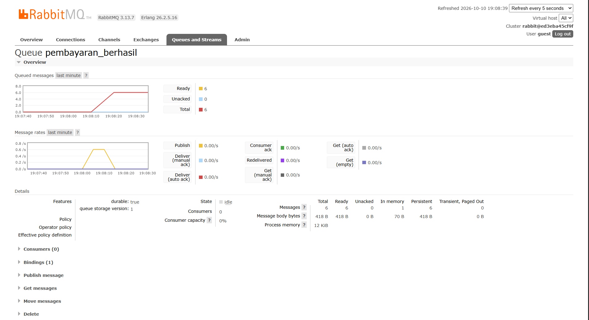
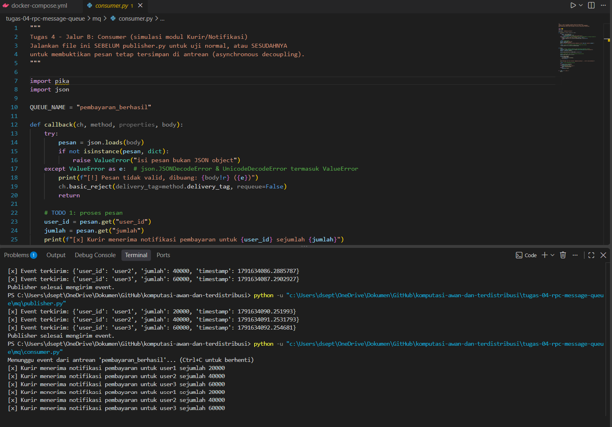
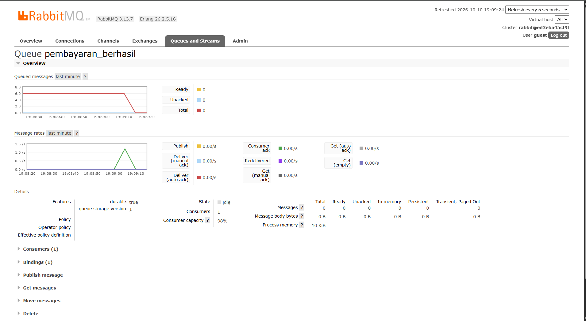

# Jurnal Proses — Tugas 4

## Jalur yang dipilih
- [RPC / MQ / keduanya], alasan: ...

## Kendala teknis
- Error saat setup rabbitmq dan menjalankan consumer.py

## Uji "pesan tidak hilang" (khusus Jalur B)
- Langkah uji: matikan consumer → jalankan publisher → nyalakan consumer
- Hasil yang diamati: 

jalankan `publisher.py` dua kali saat `consumer.py` belum dinyalakan.
Setiap kali jalan, publisher mengirim 3 event pembayaran (user1 = 20000, user2 = 40000, user3 = 60000), jadi total ada 6 pesan. Di dashboard RabbitMQ, queue `pembayaran_berhasil` menunjukkan Ready = 6, Unacked = 0, danConsumers = 0. Artinya pesan sudah masuk antrean, tetapi belum ada consumer yang mengambilnya  

Setelah itu `consumer.py` dinyalakan. Consumer langsung mencetak 6 baris"Kurir menerima notifikasi pembayaran" dengan urutan user1, user2, user3, user1, user2, user3, sama persis dengan urutan saat dikirim 

Dashboard kemudian menunjukkan Ready = 0 dan Consumers = 1 
Jadi tidak ada pesan yang hilang, walaupun consumer sedang mati ketika publisher mengirim

## Log Penggunaan AI (Level 2)

> Wajib diisi sesuai kebijakan Level 2 di [`../RUBRIK-UMUM.md`](../RUBRIK-UMUM.md). Tulis "Tidak memakai AI" pada baris pertama jika memang tidak dipakai. Hanya untuk brainstorming ide/outline — bukan untuk kode/analisis/teks akhir.

| Tanggal | Tool AI | Prompt yang diberikan | Ringkasan saran/ide AI | Bagaimana diolah jadi tulisan/kode sendiri |
|---|---|---|---|---|
| 10/10/2026 | Gemini | "Jelaskan konsep message persistence, peran durable queue pada RabbitMQ, dan alur implementasi Publisher di Python" | AI menjelaskan perbedaan antrean durable dengan persistent message (`delivery_mode=2`), serta fungsi asynchronous decoupling pada message broker. | Mengimplementasikan kode `publisher.py` secara mandiri, menguji pengiriman 3 pesan event ke RabbitMQ lokal di laptop, dan memvalidasi hasilnya lewat dashboard. |
